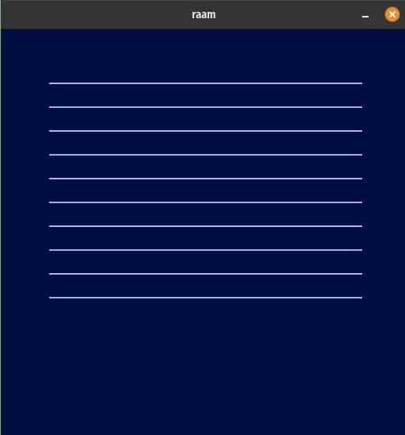

# raam
Raam is a GPU powered, browserless tabular data viewer.
It is built in rust, on top of winit and wgpu.

## Status

Can draw grid lines and scroll.



## Usage 

Run with:

```sh
cargo run
```
