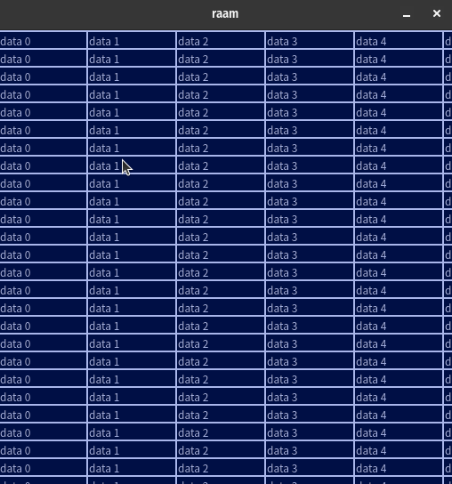

# raam
Raam is a GPU powered, browserless tabular data viewer.
It is built in rust, leaning heavily on [winit](https://github.com/rust-windowing/winit), [wgpu](https://github.com/gfx-rs/wgpu) and [cosmic-text](https://github.com/pop-os/cosmic-text).

## Status

Can draw grid lines and scroll and place text inside cells.



## Usage 

Run with:

```sh
cargo run
```
