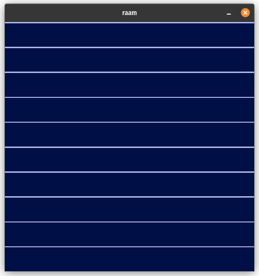

# raam
Raam is a GPU powered, browserless tabular data viewer.
It is built with winit and wgpu.

## Status

Can draw horizontal lines using vertex, index and instancing buffers.



## Usage 

Run with:

```sh
cargo run
```
